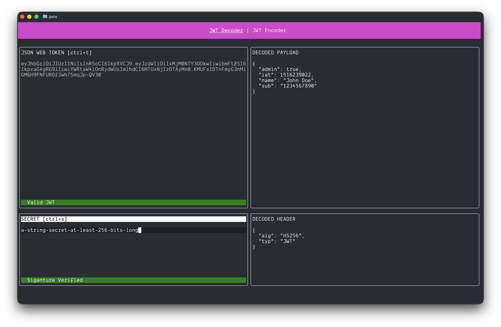

# 🚀 jwtx 🔐

<p align="center">
  
</p>

<p align="center">
  <em>JWT decoder/encoder for your terminal! 🎯</em>
</p>

<p align="center">
  <a href="#installation"><strong>Install</strong></a> •
  <a href="#features"><strong>Features</strong></a> •
  <a href="#usage"><strong>Usage</strong></a> •
  <a href="#keyboard-shortcuts"><strong>Shortcuts</strong></a>
</p>

<br/>

[](https://github.com/gurleensethi/jwtx)
[](https://github.com/gurleensethi/jwtx/blob/master/LICENSE)
[](https://goreportcard.com/report/github.com/gurleensethi/jwtx)
[](https://github.com/gurleensethi/jwtx/releases)
[](https://github.com/gurleensethi/jwtx/graphs/contributors)

## ✨ Features

- 🛠️ **Real-time JWT Decoding** - Instantly decode JWT tokens as you type
- 🎨 **Beautiful TUI Interface** - Clean, intuitive terminal interface
- ⌨️ **Keyboard Navigation** - Full keyboard control with shortcuts
- 🔍 **Header & Payload Inspection** - View both header and payload separately
- 🛡️ **Signature Verification** - Validate JWT signatures with your secret
- 📱 **Responsive Layout** - Automatically adapts to your terminal size
- 🌟 **Visual Feedback** - Clear status indicators for validation results

## 🚀 Installation

### Option 1: Using Go

```bash
go install github.com/gurleensethi/jwtx@latest
```

### Option 2: Build from Source

```bash
git clone https://github.com/gurleensethi/jwtx.git
cd jwtx
go build -o jwtx .
./jwtx
```

## 🎯 Usage

Simply run the application and start exploring JWT tokens:

```bash
jwtx
```

Then paste your JWT token in the **JSON WEB TOKEN** field and your secret in the **SECRET** field. The decoded header and payload will appear instantly!

## ⌨️ Keyboard Shortcuts

| Shortcut | Action |
|----------|--------|
| `Ctrl + T` | Focus on JWT Token field |
| `Ctrl + S` | Focus on Secret field |
| `Ctrl + H` | Focus on Decoded Header |
| `Ctrl + P` | Focus on Decoded Payload |
| `Ctrl + C` | Quit application |
| `Ctrl + Q` | Alternative quit |

## 📈 Stats


## 📜 License

[MIT ©](https://github.com/gurleensethi/jwtx/blob/master/LICENSE)

---

<p align="center">
  Made with ❤️ by <a href="https://github.com/gurleensethi">Gurleen Sethi</a>
</p>